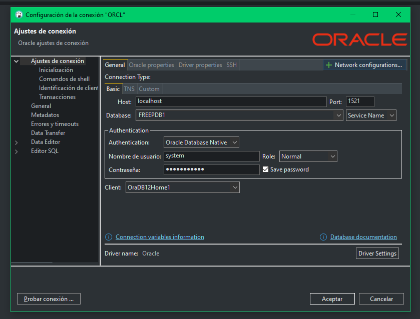

# Actividad 01 - Instalar Bases de Datos

Tal y como se requiere por la actividad propuesta vamos a instalar tanto ***MySQL*** como ***Oracle Database***. Para ello he decidido montar ambos servicios en contenedores _Docker_ dentro de mi distibución _Linux Ubuntu-24.04_ dentro de _WSL2_ para evitar saturar mi equipo personal, el cual tiene instalado _Windows_.

## Requisitos previos

### _Windows Subsystem for Linux_ (<span style="color:gray">WSL</span>)

Tener _WSL2_ instalado en nuestro equipo con una distibución _Linux_ (<span style="color:gray">en mi caso _Ubuntu-24.04_</span>). Dado que este tutorial se centra en la instalación de las Bases de Datos en si mismas se omitirá la documentación de esta parte del proceso.

### _Docker_

Para este tutorial debemos instalar _Docker_ en nuestra distribución. Para ello debemos segir los siguientes pasos:

#### 1. Instalar _Docker_

Para instalar _Docker_ abrimos una terminal en nuestra distro _Linux_ y ejecutamos el siguiente comando (<span style="color:gray">usamos el flag `-y` para evitar confirmaciones manuales</span>):

```bash
sudo apt update
sudo apt install docker.io -y
```

#### 2. Iniciar _Docker_

Una vez termine de instalarse _Docker_ iniciamos el servicio introduciendo el siguiente comando:

```bash
sudo service docker start
```
Con esto ya tendremos _Docker_ instalado y ejecutandose en nuestro _WSL2 Ubuntu-24.04_. 

### Persistencia de datos

Debemos definido las rutas donde vamos a persistir los datos de nuestros contenedores, ya que de no hacer este paso al apagar el servicio _Docker_ se perderían todos los datos almacenados.

#### 1. Definir variables

A continuación declararemos unas variables para simplificar los próximos pasos:

```bash
docker_base_dir="$HOME/dev/docker"
mysql_data_dir="$docker_base_dir/mysql-db/data"
mysql_logs_dir="$docker_base_dir/mysql-db/logs"
oracledb_data_dir="$docker_base_dir/oracle-db/data"
oracledb_logs_dir="$docker_base_dir/oracle-db/logs"
db_root_psswd="${DB_ROOT_PSSWD:-my_p4ssw0rd}" # mover esto a env por motivos de seguridad
```

Con esto tenemos disponibles en nuestra sesión de terminal las rutas a las carpetas de persistencia de datos y registros de nuestros contenedores almacenadas en variables para su posterior uso.

También se ha guardado en la variable `db_root_psswd` la contraseña que se usará para el usuario _root_ (<span style="color:gray">lo ideal es almacenar la contraseña en una **_variable de entorno_**, pero como no las he configurado para este ejemplo hemos puesto un **_fallback_** con el valor `my_p4assw0rd`</span>).

#### 2. Crear directorios de persistencia de datos

Para crear dichas rutas, ejecutaremos en nuestra terminal el siguiente comando (<span style="color:gray">el flag `-p` crea directorios intermedios si no existen</span>):

```bash
mkdir -p "$mysql_data_dir" \
    "$mysql_logs_dir" \
    "$oracledb_data_dir" \
    "$oracledb_logs_dir"
```

Ahora crearemos contenedores para **_MySQL_** y **_OracleDatabase_**.

## Instalar **_MySQL_** en _WSL2_ con _Docker_


### Crear y ejecutar contenedor de ***MySQL***

Para crear el contenedor _Docker_ de **_MySQL_** ejecutamos el siguiente comando:

```bash
sudo docker run --name mysql-db \
                -e MYSQL_ROOT_PASSWORD="$db_root_psswd" \
                -v "$mysql_data_dir":/var/lib/mysql \
                -v "$mysql_logs_dir":/var/log/mysql \
                -p 3306:3306 \
                -d mysql:latest
```
#### Explicación:

- `--name <CONTAINER_NAME>` Nombre del contenedor creado.
- `-e <ROOT_PSSWD>` Establece la contraseña del usuario root.
- `-v <HOST_DIR:CONTAINER_DIR>` Monta directorios de persistencia en el contenedor.
- `-p <HOST_PORT:CONTAINER_PORT>` Vincula el puerto del host al puerto del contenedor.
- `-d <IMAGE_NAME:VERSION>` Imagen y versión con la que vamos a crear el contenedor.

### Verificar ejecución del contenedor

Cuando termine de crear descargar la imagen y crear el contenedor podemos mostrar la lista de contenedores activos introduciendo lo siguiente en nuestra terminal:

```bash
sudo docker ps
```

Debe mostrar algo similar a esto:


### Conectarme a ***MySQL*** directamente desde el _Docker_

Ejecutar el siguiente comando para entrar dentro del contenedor de **_MySQL_** que acabamos de crear.

```bash
sudo docker exec -it mysql-db bash
```

Una vez dentro del contenedor ejecutar este comando para iniciar el servicio de **_MySQL_**.

```bash
mysql -u root -p
```

Se nos pedirá la contraseña del usuario _root_ que establecimos anteriormente. Una vez introducida podemos insertar comandos de ***MySQL*** para interactuar con nuestro servicio.

A continuación crearemos una base de datos nueva con una tabla de ejemplo y 2 consultas:

```sql
CREATE DATABASE daw;

USE daw;

CREATE TABLE examples (
  id INT AUTO_INCREMENT PRIMARY KEY,
  value VARCHAR(255) NULL
);

INSERT INTO examples (id, value) VALUES (
  (1, "Prueba de persistencia"),
  (2, "Miami me lo confirmo")
);

SELECT * FROM examples;

SELECT * FROM examples WHERE value LIKE "%Miami%";
```

Conforme vayamos interactuando con el servicio veremos algo como esto:

<!--  -->


## Crear y ejecutar contenedor de **_OracleDatabase_**

Los pasos son similares a los llevados a cabo anteriormente para **_MySQL_** pero en este caso debemos registrar una cuenta en _Oracle_ para poder obtener una imagen de _Docker_ su base de datos. Para ello debemos visitar su [página web]() y rellenar el siguiente formulario.


Ahora podemos iniciar sesión con nuestra cuenta de oracle desde nuestra terminal:

```bash
sudo docker login container-registry.oracle.com
```

Para a continuación, despues de introducir nuestras credenciales descargar la imagen de oracle database:

```bash
sudo docker pull container-registry.oracle.com/database/free:latest
```
Y por último procedemos a crear y ejecutar contenedor de Oracle Database.

```bash
sudo docker run --name oracle-db \
								-e ORACLE_ACCEPT_LICENSE=true \
								-e ORACLE_PWD="$db_root_psswd" \
								-v "$oracledb_data_dir":/opt/oracle/oradata \
								-v "$oracledb_logs_dir":/opt/oracle/diag \
								-p 1521:1521 -p 5500:5500 \
								-d container-registry.oracle.com/database/free:latest
```

Ya solo nos quedaría comprobar que efectivamente está el contenedor correctamente levantado y conectarnos a la BBDD. En mi caso he usado DBeaver para gestionar la conexión

